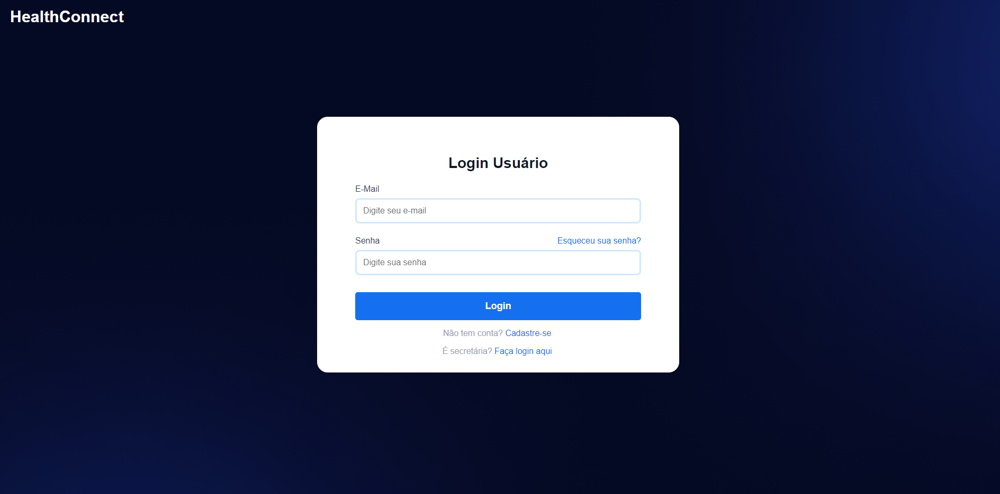
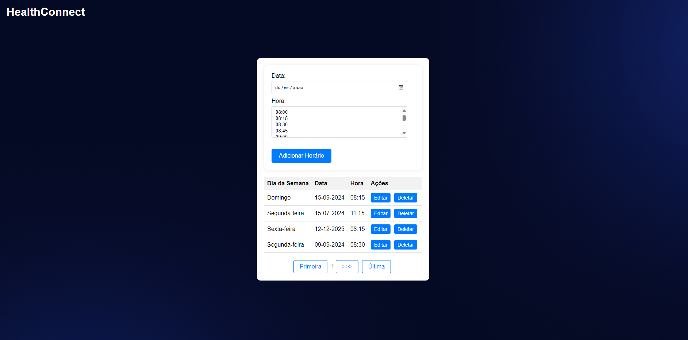

## Engenharia de Software - 2024.1 | Universidade Federal do Tocantins - Palmas
**Curso:** Bacharelado em Ciência da Computação \
**Professor:** Edeilson Milhomem da Silva\
**Time**: Breno Borges, Gabriel Barbosa dos Santos Martiliano, Hátilan Caio Alves Fontes, Gustavo Gonzaga dos Santos, João Pedro Ribeiro Dias Moraes

## Sobre o Projeto:
Nosso sistema web, projetado especialmente para simplificar sua vida quando se trata de agendar consultas médicas.
Adeus às intermináveis chamadas telefônicas e longas esperas por uma resposta. Com nosso sistema, você pode agendar sua consulta em questão de minutos, tudo com alguns cliques simples. Libere seu tempo para o que realmente importa na sua vida!

## Relatórios de gestão
- Sprint 1 - [Relatório 1](https://github.com/CaesarCrew/Eng_Soft-Grupo1/releases/tag/v1.1.0)
- Sprint 2 - [Relatório 2](https://github.com/CaesarCrew/Eng_Soft-Grupo1/releases/tag/v1.2.0-autentifica%C3%A7%C3%A3o_e_autoriza%C3%A7%C3%A3o)
- Sprint 3 - [Relatório 3](https://github.com/CaesarCrew/Eng_Soft-Grupo1/releases/tag/v1.3.0-mvc)

## Definindo os Requisitos Funcionais do Projeto

### RF01 - Realizar Login no Sistema

#### Descrição:
Este requisito permite que os usuários realizem login no sistema para acessar suas funcionalidades. Eles devem fornecer suas credenciais de login (e-mail e senha) e ter a opção de redirecionamento para a tela de cadastro ou redefinição de senha, conforme necessário.

#### User Story:
**Persona 01 - Usuário Comum**  
**Persona 02 - Secretaria**  
**User Story:** Como usuário comum ou secretaria, desejo realizar login no sistema para acessar suas funcionalidades.  
**Critério de Aceitação:** 
- O usuário deve ter suas credenciais cadastradas no banco de dados e inserir corretamente seu e-mail e senha.
- Após o login bem-sucedido, o usuário terá acesso às funcionalidades do sistema.

## Protótipo

### RF02 - Cadastrar Usuário no Sistema

#### Descrição:
Este requisito permite que os usuários se cadastrem no sistema, preenchendo campos obrigatórios como Nome, Senha, E-mail, Telefone, CPF, Sexo, Data de Nascimento, CEP, Logradouro, Número, Complemento, Bairro, Cidade e Estado.

#### User Story:
**Persona 01 - Paciente**  
**User Story:** Como paciente, desejo me registrar no sistema para acessar suas funcionalidades.  
**Critério de Aceitação:** 
- O paciente deve preencher os campos obrigatórios e clicar no botão "Enviar".
- O sistema deve verificar se o e-mail fornecido já está em uso e registrar o paciente no sistema com sucesso.

## Protótipo

### RF03 - Redefinir Senha no Sistema

#### Descrição:
Este requisito permite que os usuários restaurem sua senha caso a tenham esquecido, solicitando uma redefinição através do e-mail registrado.

#### User Story:
**Persona 01 - Usuário Comum**  
**User Story:** Como usuário comum, desejo restaurar minha senha caso a tenha esquecido.  
**Critério de Aceitação:** 
- O usuário deve poder solicitar a redefinição de senha fornecendo seu e-mail registrado.
- Após solicitar a redefinição, o usuário deve receber um e-mail com um link seguro para redefinir a senha.

### RF04 - Controle de Sessão

#### Descrição:
Este requisito garante que os usuários permaneçam logados no sistema até decidirem sair.

#### User Story:
**Persona 01 - Usuário Comum**  
**Persona 02 - Secretaria**  
**User Story:** Como usuário comum ou secretaria, desejo permanecer logado no sistema.  
**Critério de Aceitação:** 
- O usuário deve estar devidamente autenticado no sistema para entrar e permanecer nele.

### RF05 - Cadastrar Horários Disponíveis no Sistema

#### Descrição:
Este requisito permite que a secretaria adicione os horários disponíveis para consulta no sistema.

#### User Story:
**Persona 01 - Secretaria**  
**User Story:** Como secretaria, quero adicionar os horários disponíveis para consulta no sistema.  
**Critério de Aceitação:** 
- A secretaria deve estar devidamente logada no sistema para realizar esta tarefa.

### RF06 - Deletar Horários Disponíveis no Sistema

#### Descrição:
Este requisito permite que a secretaria exclua horários previamente cadastrados no sistema.

#### User Story:
**Persona 01 - Secretaria**  
**User Story:** Como secretaria, desejo poder excluir horários previamente cadastrados no sistema.  
**Critério de Aceitação:** 
- A secretaria deve estar devidamente logada no sistema para realizar a exclusão.
- Após a exclusão, o sistema deve atualizar a lista de horários disponíveis.

### RF07 - Editar Horários Disponíveis no Sistema

#### Descrição:
Este requisito permite que a secretaria edite horários previamente cadastrados no sistema.

#### User Story:
**Persona 01 - Secretaria**  
**User Story:** Como secretaria, desejo poder editar horários previamente cadastrados no sistema.  
**Critério de Aceitação:** 
- A secretaria deve estar devidamente logada no sistema para realizar a edição.
- Após a edição, o sistema deve atualizar os detalhes do horário modificado.

### RF08 - Listar Horários Disponíveis no Sistema

#### Descrição:
Este requisito permite que os usuários visualizem os horários disponíveis para consulta no sistema.

#### User Story:
**Persona 01 - Paciente**  
**Persona 02 - Secretaria**  
**User Story:** Como paciente ou secretaria, desejo visualizar os horários disponíveis para consulta no sistema.  
**Critério de Aceitação:** 
- Os horários disponíveis devem ser apresentados de forma clara e organizada, indicando a data e hora disponível .
- Os horários devem ser atualizados em tempo real para refletir quais horários ainda estão disponíveis para agendamento.
